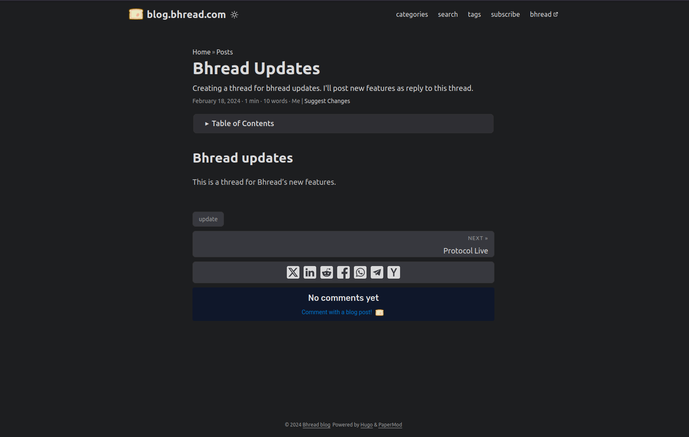
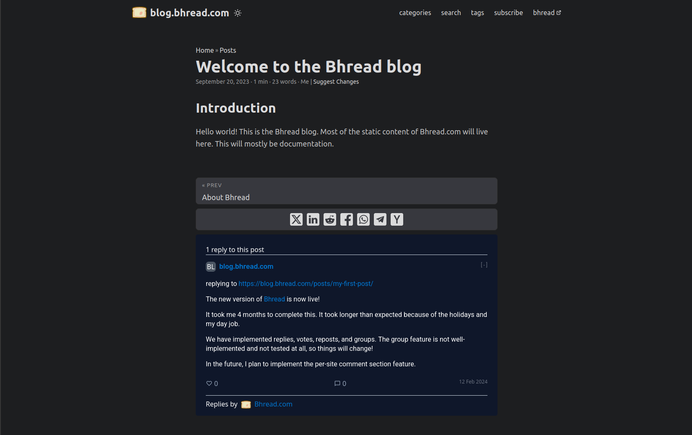

replying to [Bhread updates](https://blog.bhread.com/posts/bhread-updates/).

## What's this?

Bhread now provides a piece of code you can put on your site that will display replies from all of Bhread.

This feature will also work if the user doesn't have JS enabled.

### How to add a Bhread comment section in hugo

Copy this code:

```html
  <script>
    // Wait for bhread to send a message to resize
    window.addEventListener('message', function(e) {
      /* This code adjusts the comment section to its full height.
      ** You may omit this if you're okay with a scrollable comment section.
      **/
      const commentsSection = document.getElementById('bhread-comments');
      // Only show comment section if it loads successfully.
      commentsSection.style.display = 'block';
      const eventName = e.data[0];
      const data = e.data[1];
      switch(eventName) {
        case 'setHeight':
          commentsSection.setAttribute('height', data);
          break;
      }
    }, false);

  </script>
  <iframe id="bhread-comments" src="https://bhread.com/comment-embed/{{ absURL .Page.RelPermalink }}" width="100%" height="350px"  frameBorder="0" onload="this.style.display = 'none'" loading="lazy" style="border-radius: 5px;"> </iframe>
```

In Hugo, find the template or page that's used for single articles. Paste this piece of code after the content section or anywhere you'd like to display the comments in the page.

This will add an `iframe` element to your posts with 350px height.

Here are some things to note:

- If it loads successfully, It will reduce its height to 80px if no comments were found, or it will adjust its height based on the number of comments, displaying all comments.
- If it doesn't load successfully, it will leave a box that doesn't have any color with height of 350px (basically looks like an empty space).
- If the user doesn't have JS enabled, it will still work but the height remains at 350px which will be scrollable.
- If the request comes from a different domain than the url that is being requested, the reqeust will be unsuccessful. An error 403 (forbidden) will be returned.

### Screenshots



*How it looks like without replies. You can probably also look at this post you're reading and find the comment section*



*With a single reply*

### Future improvements

In the future, we aim to add more (and better) instructions for integrating this to other site makers (Wordpress, Jekyll, etc) we also aim to add customizability options for comment embeds like link colors, and setting the background color.

Stay tuned by subscribing to the Feed! 8)
